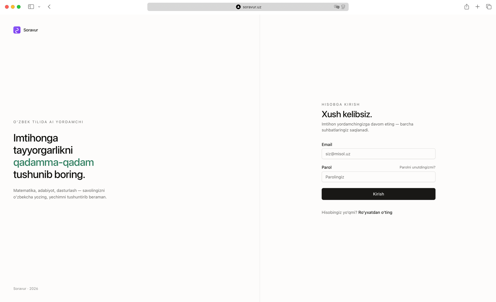
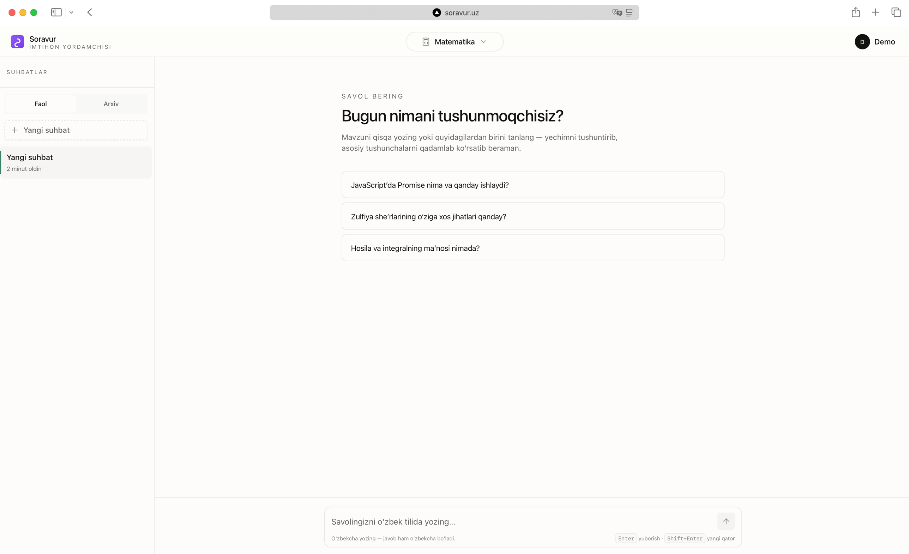

<div align="center">


### Imtihonga tayyorgarlikni qadamma-qadam.

**Soravur** is a Uzbek-language AI study companion. Ask in O'zbek, get a step-by-step explanation in O'zbek — built for students preparing for school exams and DTM (Davlat Test Markazi).

[**Live → soravur.uz**](https://soravur.uz) · [Report bug](https://github.com/noonosh/soravur.uz/issues) · [Roadmap](MODEL_UPGRADE_PLAN.md)

[](https://nextjs.org)
[](https://react.dev)
[](https://convex.dev)
[](https://better-auth.com)
[](https://tailwindcss.com)
[](https://bun.sh)

</div>

---

<div align="center">



<sub>Sign-in — asymmetric split, warm stone palette, emerald accent.</sub>

<br /><br />



<sub>Chat home — three subjects, randomized starter prompts, model auto-routes by subject.</sub>

</div>

---

## Why Soravur

Most AI study tools default to English and feel like Google Translate when forced into Uzbek. Soravur is **Uzbek-first**: every system prompt, every UI string, every error message is in O'zbek. The model is instructed to refuse non-Uzbek replies and a heuristic gate blocks obviously non-Uzbek input before it reaches the API — so students get focused, in-language help that respects their preparation context.

Three specialised modes — **Matematika**, **Adabiyot**, **Dasturlash** — auto-route to the appropriate model when a student picks a starter prompt, so a literature question never lands on a math-tuned chain.

---

## Features

| | |
|---|---|
| **Uzbek-only output** | Heuristic input filter + system-prompt enforcement + auto-retry if the model drifts off-language. |
| **Subject-aware routing** | Math, literature, programming each have their own model slot in `models.json`. Click a starter prompt → model switches. |
| **Streaming responses** | Real-time SSE from OpenRouter with token-by-token UI updates and Convex-reactive persistence. |
| **Math-ready rendering** | KaTeX inline + display math, GFM tables, syntax-highlighted code, and Markdown structure. |
| **Real auth** | Email + password via Better-Auth, mandatory verification, password reset, per-target email throttling, soft-delete with confirmation email. |
| **Thread management** | Active / Arxiv tabs, archive + restore, auto-titled from first message. |
| **Account control** | Editable display name, theme tri-state (light/dark/system), account deletion with confirmation. |
| **Rate-limited** | Per-user request limits stored in the database — survives restarts and serverless cold starts. |
| **Anti-cheating guardrails** | Cheating-keyword detector + system-prompt directive to redirect students toward learning, not answer-dumping. |
| **Operational** | Sentry error tracking, structured logs on chat errors, hand-rolled CORS on REST endpoints. |

---

## Live demo

**Production:** [soravur.uz](https://soravur.uz)

Sign up with any email — verification email arrives within seconds via Resend.

---

## Tech stack

| Layer | Choice | Why |
|---|---|---|
| Frontend | **Next.js 16** + React 19.2 (Compiler on, `typedRoutes`) | Type-safe routes; React Compiler removes most `useMemo` boilerplate. |
| Styling | **Tailwind v4** + shadcn/ui (`new-york`) | Warm-stone neutrals + emerald accent token, no Lavender Slop. |
| Backend | **Convex** (reactive queries, mutations, actions) | Real-time client state without WebSocket plumbing. |
| Auth | **Better-Auth** + `@convex-dev/better-auth` | Production-grade email flows; rate limits stored in Convex. |
| LLM | **OpenRouter** (DeepSeek default; pluggable per subject) | Single API for swapping models per subject. |
| Email | **Resend** (`mail@noono.sh`) | Transactional verification + password-reset + account-deleted templates, all in Uzbek. |
| Observability | **Sentry** | Errors gated on `NEXT_PUBLIC_SENTRY_DSN` — silent in dev. |
| Tooling | **Bun 1.3** + **Turborepo 2** | Workspace catalog versioning, isolated linker, fast monorepo builds. |
| Tests | **Vitest** + `convex-test` + RTL + jsdom | 22 backend + 5 web tests; runs in CI. |

---

## Project layout

```
soravur/
├── apps/
│   └── web/                Next.js app (App Router, RSC + selective Client Components)
├── packages/
│   ├── backend/            Convex schema, queries, mutations, actions, HTTP routes
│   └── config/             Shared tsconfig.base.json
├── docs/
│   └── screenshots/        Marketing screenshots
├── models.json             Single source of truth for the model dropdown
└── MODEL_UPGRADE_PLAN.md   Three-axis quality roadmap (model · context · eval)
```

---

## Quick start

Requires [Bun](https://bun.sh) 1.3+.

```bash
git clone https://github.com/noonosh/soravur.uz.git
cd soravur.uz
bun install
```

**One-time Convex setup** (from `packages/backend/`):

```bash
cd packages/backend
bunx convex dev --configure --until-success
bunx convex env set OPENROUTER_API_KEY sk-or-...
bunx convex env set SITE_URL http://localhost:3000
bunx convex env set RESEND_API_KEY re_...    # optional in dev — falls back to console
```

Web env (`apps/web/.env.local`):

```
NEXT_PUBLIC_CONVEX_URL=<your-convex-cloud-url>
```

Run everything:

```bash
bun run dev          # turbo: web + convex
# or independently:
bun run dev:web
bun run dev:server
```

Open [http://localhost:3000](http://localhost:3000).

---

## Architecture

```
┌──────────────────────┐     SSE stream      ┌──────────────────────┐
│   Next.js (Vercel)   │◀───────────────────▶│  Convex (HTTP route) │
│   App Router · RSC   │                     │   /api/threads/...   │
└──────────┬───────────┘                     └──────────┬───────────┘
           │                                            │
           │  reactive queries (WebSocket)              │  action runtime
           ▼                                            ▼
┌──────────────────────┐                     ┌──────────────────────┐
│  Convex queries      │                     │   OpenRouter API     │
│  (threads, messages) │                     │  (DeepSeek, …)       │
└──────────────────────┘                     └──────────────────────┘
           │                                            │
           ▼                                            ▼
┌──────────────────────┐                     ┌──────────────────────┐
│  Convex DB           │                     │      Resend          │
│  users · threads ·   │                     │  verify · reset ·    │
│  messages · usage    │                     │  account-deleted     │
└──────────────────────┘                     └──────────────────────┘
```

Chat pipeline highlights (`packages/backend/convex/chat.ts`):
1. Verify thread ownership against `users._id`
2. Per-user rate-limit (12 req/min, fixed window, persisted)
3. Heuristic Uzbek-language gate on input
4. Cheating-keyword reject
5. Stream from OpenRouter — buffer SSE deltas, write patches reactively
6. Retry once with stricter prompt if output drifts off-Uzbek
7. Persist message + log usage + auto-title thread from first user message

---

## Available scripts

| Command | What it does |
|---|---|
| `bun run dev` | Start web + convex via turbo |
| `bun run dev:web` | Web only |
| `bun run dev:server` | Convex only |
| `bun run build` | Build all packages |
| `bun run check-types` | Type-check across the workspace |
| `bun run test` | Vitest across web + backend |

---

## Roadmap

See [**MODEL_UPGRADE_PLAN.md**](MODEL_UPGRADE_PLAN.md) for the three-axis quality roadmap:
- **Model layer** — subject-specific OpenRouter routing, reasoning-model for math, cascade strategies.
- **Context layer** — subject-specific system prompts, few-shot examples, anti-hallucination directives, Uzbek curriculum RAG.
- **Eval layer** — golden test set, LLM-as-judge, in-app thumbs-up/down feedback loop.

---

## Contributing

Issues and pull requests welcome. Before opening a PR:

```bash
bun run check-types
bun run test
```

The CI workflow (`.github/workflows/ci.yml`) runs the same checks on every PR — keep it green.

---

## Acknowledgments

Built for O'zbekiston students. Powered by [Convex](https://convex.dev), [Better-Auth](https://better-auth.com), [OpenRouter](https://openrouter.ai), and [Resend](https://resend.com).
